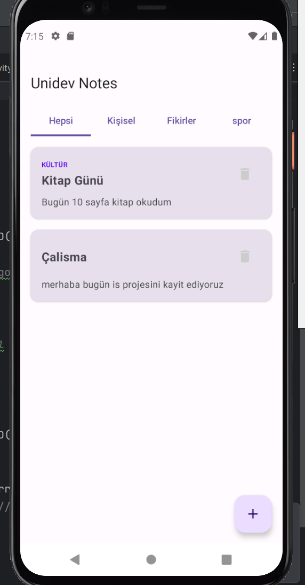
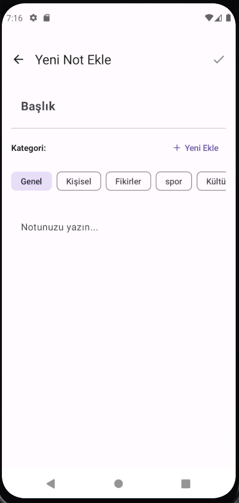

# myNotes 📝

**myNotes**, modern Android teknolojileri (Jetpack Compose, Room, MVVM) kullanılarak geliştirilmiş, kullanıcıların notlarını kategorize ederek saklamasına ve yönetmesine olanak tanıyan minimalist bir mobil uygulamadır.

## 🚀 Özellikler

* **Kategorize Not Sistemi:** Notları "Kişisel", "Spor", "Fikirler" gibi özel kategoriler altında gruplandırma.
* **Modern UI/UX:** Tamamen Jetpack Compose ve Material 3 bileşenleri ile tasarlanmış kullanıcı arayüzü.
* **Yerel Veri Saklama:** Room Persistence Library ile verilerin cihaz üzerinde güvenli ve hızlı bir şekilde depolanması.
* **Esnek Kategori Yönetimi:** Dinamik olarak yeni kategoriler ekleme ve bu kategorilere göre notları filtreleme.
* **Gelişmiş Veri Yapısı:** Çakışmaları önlemek için `UUID` tabanlı benzersiz anahtarlar (Primary Keys) kullanımı.
* **Dil ve Karakter Desteği:** Türkçe karakter uyumluluğu için otomatik `tr-TR` lokalizasyon yapılandırması.

## 🛠 Teknolojik Yığın (Tech Stack)

* **Dil:** Kotlin
* **UI:** Jetpack Compose (Material 3)
* **Veritabanı:** Room Database
* **Mimari:** MVVM (Model-View-ViewModel)
* **Navigasyon:** Compose Navigation (Type-safe arguments)
* **Thread Yönetimi:** Kotlin Coroutines

## 📸 Ekran Görüntüleri

| Not Listesi | Yeni Not Ekleme |
| :---: | :---: |
|  |  |

> *Not: Ekran görüntüleri projenin mevcut UI tasarımını temsil etmektedir.*

## 📂 Proje Yapısı

Uygulama, sürdürülebilir bir mimari için katmanlı bir yapı üzerine inşa edilmiştir:

```text
com.unidev.notes
├── data        # Database, DAO ve Repository (Room entegrasyonu)
├── model       # Entity sınıfı (Note ve Category modelleri)
├── ui
│   ├── screens # Compose ekranları (NoteListScreen, NoteEditScreen)
│   └── theme   # Tema renkleri ve ViewModel yapılandırması
└── MainActivity.kt # Uygulama giriş noktası ve Navigation Host

⚙️ Kurulum ve Çalıştırma

1.Bu depoyu klonlayın:

git clone [https://github.com/kullanici_adiniz/unidev-notes.git](https://github.com/kullanici_adiniz/unidev-notes.git)

2.Android Studio (Hedgehog veya üstü) ile projeyi açın.

3.Gradle senkronizasyonunun tamamlanmasını bekleyin.

4.Bir emülatör veya fiziksel cihaz bağlayarak Run butonuna basın.
